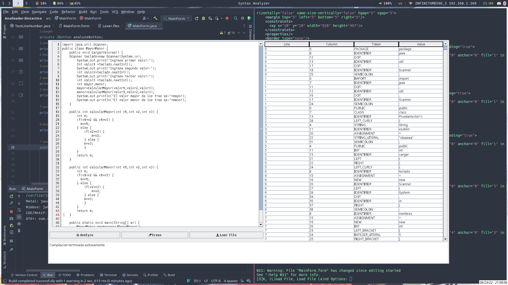

# syntax-analyzer
A syntax analyzer that accepts a subset of the java language grammar made with java swing

# Screenshots

# Installation
Just clone the repo and open it with IntelliJ Idea or get it directly from the IDE with the `get from VCS` option
